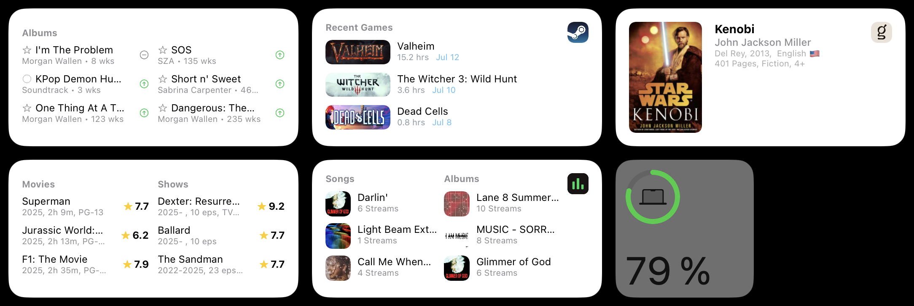

# iOS Widgets for Scriptable

A collection of custom widgets for the [Scriptable](https://scriptable.app/) app that bring dynamic content to your iOS home screen. These widgets are fully customizable and connect to external APIs to display real-time information.

## Available Widgets

### Stats.fm Month Widget

Displays your top three tracks and albums from Stats.fm, which aggregates data from Spotify and Apple Music.

**What it shows:**

- Top tracks and albums with cover art
- Stream counts for each item
- Direct link to the Stats.fm app

**Setup:** Enter your Spotify username in the `USER_ID` field within the `CONFIG` object.

### Movie & TV Widget

Shows the top 3 movies and TV shows from IMDB’s most popular charts.

**What it shows:**

- Movie and TV show titles with release years
- Star ratings with visual indicators
- Clickable links that open in the IMDB app

### Currently Reading Widget

Displays information about a book you’re currently reading using its ISBN number.

**What it shows:**

- Book cover and metadata

**Setup:** Configure the widget parameter with your book’s ISBN-10 number (see installation steps 6-8 below).

### Billboard 200 Widget

Shows the top 6 albums from the Billboard 200 album chart.

**What it shows:**

- Album rankings with position change indicators
- Color-coded position tracking
- Adapts to different widget sizes

### Steam Recent Activity Widget

Displays your recent Steam gaming activity.

**What it shows:**

- Recent games with cover images
- Total playtime and last played dates
- Adapts to different widget sizes

## What You’ll Need

- [Scriptable](https://scriptable.app/) app on your iOS device
- Account credentials for relevant services (Spotify username for Stats.fm widget, Steam username for Steam widget)

## How to Install

### Adding to Scriptable:

1. Copy the desired `.js` file from the `/files` folder into your Scriptable app

### Adding to Your Home Screen:

1. Long press any app on your home screen
1. Tap “Edit Home Screen”
1. Tap the “+” button at the top
1. Scroll down and select “Scriptable”
1. Choose your preferred widget size
1. Tap the newly added widget
1. Select the script you want to use
1. Configure any required parameters

**Note:** You can add multiple widgets to your home screen and configure each one individually.

## Updates

All widgets refresh automatically every 24 hours to ensure you’re seeing the latest information.

## License

These widgets are released under the Unlicense, meaning you’re free to use, modify, and distribute them as you wish.
