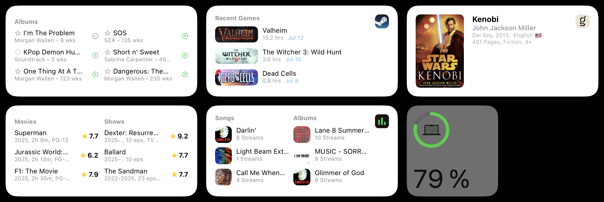

# Mosaic

iOS and macOS widgets for the [Scriptable](https://scriptable.app/) app. Shows data from Billboard, IMDb, Steam, Hacker News, GitHub, Wikipedia, Bluesky, and more.



## Setup

### 1. Install Scriptable

Download [Scriptable](https://apps.apple.com/app/scriptable/id1405459188) from the App Store on your iPhone, iPad, or Mac.

### 2. Add the widget script

Copy `Mosaic.js` into your Scriptable folder:

```
~/Library/Mobile Documents/iCloud~dk~simonbs~Scriptable/Documents/
```

On iOS, Scriptable syncs scripts through iCloud automatically.

### 3. Create widget-config.json

Create a file called `widget-config.json` in the same Scriptable folder. This is where all your personal settings go. The file syncs across devices through iCloud.

Copy `widget-config.json` from this repo as a starting point, then fill in your values. A minimal config looks like this:

```json
{
  "version": 1,
  "apiToken": "your-api-token",
  "sources": {}
}
```

**All user configuration belongs in widget-config.json.** Do not edit the JS file for settings.

### 4. Add a widget to your home screen

Long-press your home screen, tap +, search for Scriptable, pick a widget size. Edit the widget and set the Script to `Mosaic`. Set the Parameter to a source name (see below).

## Configuration reference

Each field in `widget-config.json` explained.

### apiToken

Your personal API token for api.michi.onl. Required for most data sources.

```json
"apiToken": "your-api-token"
```

### sources.steam

Steam usernames whose recent games you want to track. Use the vanity URL name from your Steam profile page (the part after `/id/`), or a numeric Steam ID.

```json
"steam": {
  "profiles": ["gabelogannewell", "player2"]
}
```

### sources.github

GitHub repositories to watch for new releases. Use `owner/repo` format, the same as in the GitHub URL.

```json
"github": {
  "repos": ["anthropics/claude-code", "nicklockwood/SwiftFormat"]
}
```

### sources.wikipedia

Track recent edits on your Wikipedia watchlist.

- **usernames** - Your Wikipedia username. This is the same across all language wikis.
- **tokens** - Your watchlist token. To find it: go to any Wikipedia, click Preferences, open the Watchlist tab, scroll to "Watchlist token". Copy the string shown there.
- **languages** - Which language wiki to check. Use the two-letter code: `"en"` for English Wikipedia, `"de"` for German, etc. For multiple wikis, separate with commas: `"en,de"`.

```json
"wikipedia": {
  "usernames": "Example",
  "tokens": "abc123def456",
  "languages": "en,de"
}
```

### sources.astronomy

Sun and moon times, UV index, and golden hour for a fixed location. Setting coordinates means the widget does not need GPS access each time it refreshes.

- **latitude** - Decimal latitude (e.g. `"48.2082"` for Vienna)
- **longitude** - Decimal longitude (e.g. `"16.3738"` for Vienna)

If you leave these out, the widget falls back to device location.

```json
"astronomy": {
  "latitude": "48.2082",
  "longitude": "16.3738"
}
```

### sources.bluesky

Your Bluesky handle. The widget shows your recent posts from the public API.

```json
"bluesky": {
  "handle": "you.bsky.social"
}
```

### sources.statusboard

A dashboard that pulls one top item from each source you list. Pick which sources appear.

```json
"statusboard": {
  "boardSources": ["hackernews", "github", "steam", "billboard"]
}
```

### sources.books

The ISBN of the book you are currently reading. The widget pulls cover art and metadata from Google Books. You can find the ISBN-13 on the back cover of most books or on its Goodreads/Amazon page.

```json
"books": {
  "defaultIsbn": "9780099518471"
}
```

You can also pass an ISBN as a widget parameter (`books:9780099518471`) to override this default.

## Widget parameters

Set the Parameter field in the Scriptable widget settings on your home screen.

| Parameter | What it shows |
|---|---|
| `billboard` | Billboard 200 album chart |
| `imdb` | Popular movies and TV on IMDb |
| `steam` | Recent games from your Steam profiles |
| `hackernews` | Top stories from Hacker News |
| `github` | New releases from your tracked repos |
| `wikipedia` | Recent edits on your watchlist |
| `timeline` | All activity from your timeline |
| `timeline:contributions` | Timeline filtered to contributions |
| `timeline:media` | Timeline filtered to media |
| `activity` | Combined activity from GitHub and Wikipedia |
| `bookmarks` | Recent bookmarks from Linkding |
| `bookmarks:dev` | Bookmarks filtered by tag |
| `books` | Currently reading (uses config ISBN) |
| `books:9780099518471` | Currently reading (specific ISBN) |
| `astronomy` | Sun, moon, UV, golden hour |
| `bluesky` | Your recent Bluesky posts |
| `statusboard` | Dashboard with top items from multiple sources |
| `dhbw-timetable` | DHBW lecture timetable (upcoming events) |

## In-app setup

You can also configure sources by running the script directly inside Scriptable (tap it instead of adding as a widget). This opens a setup screen where you can edit fields for sources that need configuration. Changes save to `widget-config.json` and sync across your devices through iCloud.
